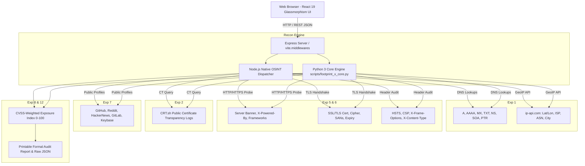

# FOOTPRINT-X: Automated Surface Exposure & Digital Footprint Analyzer

> **Academic Course Reference:** IoTCSBCL704 — Cyber Security & Forensic Analysis Laboratory  
> **Target Audience:** Cybersecurity Engineers, Penetration Testers, Academic Lab Evaluators  
> **Core Architecture:** Full-Stack OSINT Dashboard (React 19 + TypeScript + Node.js Express + Python 3 Standard Engine)

---

## 1. Project Overview & Abstract

**FOOTPRINT-X** is an automated, passive surface reconnaissance and digital footprint analyzer engineered for academic cybersecurity laboratory experimentation. It aggregates non-intrusive intelligence from public domain records, autonomous routing directories, HTTP/TLS implementations, Certificate Transparency ledgers, and developer ecosystems.

Crucially, **FOOTPRINT-X** adheres strictly to non-intrusive Open Source Intelligence (OSINT) principles: it generates **zero active exploit payloads or intrusive vulnerability probes**, making it safe, ethical, and suitable for university lab networks and academic evaluations.

---

## 2. System Architecture & Data Flow

### Mermaid Architecture Diagram



### ASCII Data Pipeline Diagram

```
+-----------------------------------------------------------------------------------+
|                        FOOTPRINT-X OPERATIONAL PIPELINE                           |
+-----------------------------------------------------------------------------------+
|                                                                                   |
|  [TARGET INPUT]                                                                   |
|      |                                                                            |
|      +---> TARGET DOMAIN (e.g., scanme.nmap.org)                                  |
|      +---> TARGET USERNAME (e.g., fyodor)                                         |
|      |                                                                            |
|      v                                                                            |
|  +-----------------------------------------------------------------------------+  |
|  | DUAL-CORE RECONNAISSANCE ENGINE                                             |  |
|  | [Node.js Native Dispatcher] <---> [Python 3 Core (footprint_x_core.py)]      |  |
|  +-----------------------------------------------------------------------------+  |
|      |                                                                            |
|      +---> MODULE 1: DNS Topology (A, MX, TXT, NS, PTR) + GeoIP/ASN Coordinates  |
|      +---> MODULE 2: HTTP Banner Grabbing, TLS Cipher Suite & Security Headers    |
|      +---> MODULE 3: CRT.sh Certificate Transparency Subdomain Enumeration        |
|      +---> MODULE 4: Cross-Platform Digital Identity & Public Profile Correlation |
|      |                                                                            |
|      v                                                                            |
|  +-----------------------------------------------------------------------------+  |
|  | EXPOSURE RISK QUANTIFIER & THREAT MATRIX (0-100 SCALE)                        |  |
|  | - Baseline Passive Exposure: 10 pts                                         |  |
|  | - Missing HSTS: +15 pts (CVSS 7.4) | Missing CSP: +15 pts (CVSS 7.1)        |  |
|  | - Missing X-Frame-Options: +10 pts | Server Banner Leak: +6 to +12 pts      |  |
|  | - Sensitive Subdomains (dev/vpn/admin): +5 pts per node (capped at 20)      |  |
|  | - Broad Identity Correlation (>=3 accounts): +8 pts                         |  |
|  +-----------------------------------------------------------------------------+  |
|      |                                                                            |
|      v                                                                            |
|  +-----------------------------------------------------------------------------+  |
|  | ACADEMIC LAB DELIVERABLES (IoTCSBCL704)                                     |  |
|  | 1. Live Web Dashboard (High-Contrast Cyber Aesthetic)                       |  |
|  | 2. Printable Formal Audit Report (@media print layout with Signoff Block)   |  |
|  | 3. Raw Structured JSON Scan Archive                                         |  |
|  | 4. Observation Record Table for Student Lab Submissions                     |  |
|  +-----------------------------------------------------------------------------+  |
+-----------------------------------------------------------------------------------+
```

---


## 3. Installation & Local Setup

### Prerequisites
- **Node.js**: v18.0.0 or higher
- **Python**: 3.8+ (standard library only; **no external pip packages required**)
- **npm** or **bun**

### Step-by-Step Installation

1. **Clone or Navigate to the Workspace Directory**:
   ```bash
   cd /app/applet
   ```

2. **Install Node.js Dependencies**:
   ```bash
   npm install
   ```

3. **Verify Python 3 Availability**:
   ```bash
   python3 --version
   ```
   *(Ensure standard library modules `socket`, `ssl`, `json`, `urllib` are accessible)*

4. **Launch the Development Server**:
   ```bash
   npm run dev
   ```
   *The server starts on port `3000` with the Express API and Vite SPA middleware.*

5. **Build for Production**:
   ```bash
   npm run build
   npm start
   ```

---

## 4. Sample Usage Commands

### A. Standalone Python CLI Engine
Students can execute the standalone Python script directly in the terminal without starting the web server:

```bash
# Full Reconnaissance against authorized target
python3 scripts/footprint_x_core.py --target scanme.nmap.org --username fyodor

# Run specific laboratory experiment (e.g., Exp 1: DNS & GeoIP)
python3 scripts/footprint_x_core.py --target scanme.nmap.org --lab-exp 1

# Run Exp 2: Certificate Transparency Subdomain Enumeration
python3 scripts/footprint_x_core.py --target wikipedia.org --lab-exp 2

# Run Exp 5 & 6: Web Banner Grabbing & Security Headers
python3 scripts/footprint_x_core.py --target owasp.org --lab-exp 6

# Run Exp 7: Identity Correlation
python3 scripts/footprint_x_core.py --target github.com --username torvalds --lab-exp 7
```

### B. REST API Endpoints (cURL)

```bash
# 1. Health check
curl -s http://localhost:3000/api/health

# 2. Complete orchestrated scan
curl -s -X POST http://localhost:3000/api/recon/all \
  -H "Content-Type: application/json" \
  -d '{"target": "scanme.nmap.org", "username": "fyodor"}'

# 3. Network & GeoIP Module only (Exp 1)
curl -s -X POST http://localhost:3000/api/recon/network \
  -H "Content-Type: application/json" \
  -d '{"target": "scanme.nmap.org"}'

# 4. Web Stack & Security Headers (Exp 5 & 6)
curl -s -X POST http://localhost:3000/api/recon/webstack \
  -H "Content-Type: application/json" \
  -d '{"target": "owasp.org"}'

# 5. Execute Python Engine via Server
curl -s -X POST http://localhost:3000/api/recon/python-exec \
  -H "Content-Type: application/json" \
  -d '{"target": "scanme.nmap.org", "username": "fyodor"}'

# 6. Retrieve IoTCSBCL704 Curriculum Syllabus
curl -s http://localhost:3000/api/lab-curriculum
```

---

## 5. Exposure Risk Scoring Methodology (Exp 8)

The exposure index assesses passive indicators on a scale of **0 (Fully Hardened) to 100 (Critically Exposed)**:

$$\text{Risk Score} = \text{Baseline} (10) + \sum \text{Deficiencies}$$

### Deficiency Weights
- **Missing HSTS Header** ($+15$ pts, CVSS 7.4): Risk of SSL-stripping MitM attacks.
- **Missing CSP Header** ($+15$ pts, CVSS 7.1): Susceptibility to Cross-Site Scripting (XSS).
- **Missing X-Frame-Options** ($+10$ pts, CVSS 5.4): Clickjacking vulnerability in nested iframes.
- **Missing X-Content-Type-Options** ($+8$ pts, CVSS 3.7): MIME sniffing confusion.
- **Explicit Version Disclosure in Server Header** ($+12$ pts, CVSS 5.3): Version tokens correlate to CVE databases.
- **Leaked X-Powered-By Header** ($+10$ pts, CVSS 5.0): Discloses backend execution framework.
- **High-Risk Subdomain Exposure** ($+5$ pts per sensitive node, max $+20$ pts): `dev.`, `staging.`, `vpn.`, `admin.` exposed in public CT logs.
- **Widespread Public Identity Footprint** ($+8$ pts, CVSS 3.2): High correlation assists social engineering reconnaissance.

---

## 6. Educational Compliance & Ethics

- **Target Authorization:** Always scan assets with explicit permission or use authorized benchmark hosts (`scanme.nmap.org`, `owasp.org`, `wikipedia.org`).
- **Zero Intrusive Probing:** The tool exclusively reads passive public records (DNS, public CT ledgers, public social endpoints, standard HTTP headers). No port flooding, brute-forcing, or exploit payloads are executed.

---
*Developed for IoTCSBCL704 Academic Laboratory Mini-Projects.*
